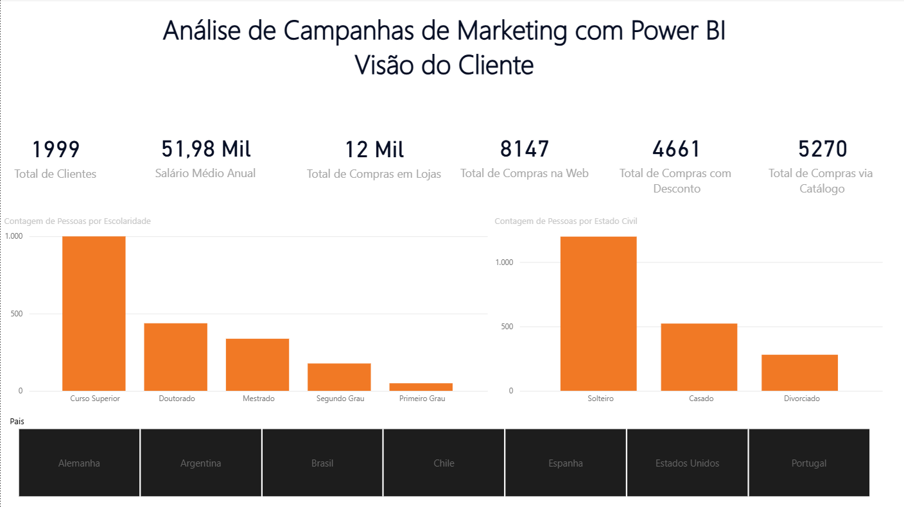
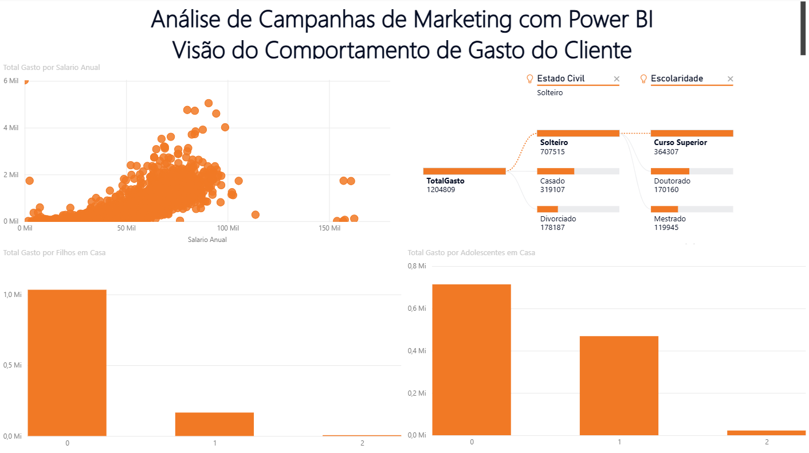
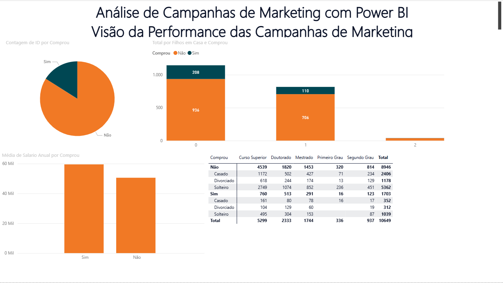
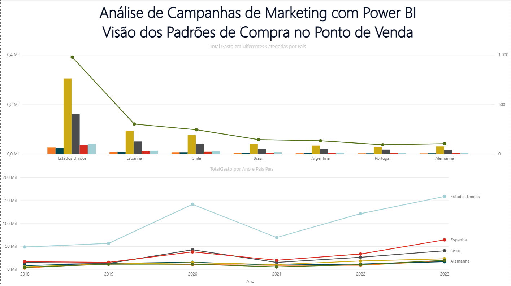

# Dashboard de Performance de Marketing

## 📌 Contexto do Projeto
Este projeto apresenta uma solução completa de Business Intelligence para a área de Marketing. Utilizando dados de campanhas digitais, o dashboard foi estruturado em **4 visões estratégicas**, permitindo que diferentes níveis da empresa (do operacional ao executivo) tomem decisões baseadas em dados.

## 📊 Estrutura do Dashboard (As 4 Visões)
O projeto foi dividido para responder a necessidades específicas de análise:

1.  **Visão do Cliente**: Destinada ao entendimento profundo do público-alvo, esta visão segmenta os consumidores por escolaridade, estado civil e nível de renda. O objetivo é identificar o perfil do cliente ideal para direcionar estratégias de marketing mais personalizada.
2.  **Visão de Comportamento de Compra do Cliente**: Desenvolvida para analisar padrões de consumo e correlações, esta visão explora a relação entre idade, renda e intenção de compra, além de monitorar a taxa de retorno dos cliente. É essencial para entender os gatilhos que levam à conversão e fidelização.
3.  **Visão de Performance das Campanhas de Marketing**: Focada no monitoramento da saúde financeira e comercial, esta visão apresenta KPIs críticos como Receita Total, Total de Pedidos e Ticket Médio. Ela permite identificar rapidamente as tendências de faturamento ao longo do tempo e os produtos que lideram o volume de vendas.
4.  **Visão dos Padrões de Compra no Ponto de Venda**: Voltada para a análise de desempenho geográfico e por unidade de negócio, esta página detalha o faturamento por loja e por país. Ela ajuda a gestão a entender quais localidades necessitam de mais atenção ou investimentos em infraestrutura.

# Detalhe Técnico #
Para garantir a interatividade e a precisão das visões, utilizei **DAX** para criar medidas dinâmicas e o **Power Query** para a normalização dos dados, tratando valores nulos e padronizando as categorias demográficas presentes no dataset original.

## 🛠️ Problema de Negócio
O desafio central era a falta de integração entre os dados demográficos dos clientes e os indicadores de performance de vendas. A equipe de marketing enfrentava dificuldades em:
* **Identificar o Perfil do Cliente Ideal (ICP)**: Não havia clareza sobre como a escolaridade, renda ou estado civil influenciavam o comportamento de compra.
* **Descentralização Geográfica**: Dificuldade em visualizar o desempenho de vendas por pais e por ponto de venda (loja física vs. online).
* **Inconsistência de Métricas**: Ausência de cálculos automáticos para ROI e Ticket Médio integrados à visão comportamental dos consumidores.

## ⚙️ Tecnologias e Dados
* **Ferramenta**: Power BI Desktop para modelagem e visualização.
* **Processamento (ETL)**: Utilização do Power Query para tratamento de dados sensíveis, conversão de tipo de dados (como faturamento e custo) e normalização de categorias demográficas.
* **Dataset**: Base de dados `dados_marketing.csv` composta por variáveis como:
  * **Demográficas**: Escolaridades, Renda, Estado Civil e Idade.
  * **Comerciais**: Volume de vendas (Loja, Web, Catálogo) e reclamações.
  * **Marketing**: Cliques, impressões, custos e retorno financeiro por campanha.
* **Lógica de Negócio**: Para a análise de rentabilidade descrita nas anotações de marketing, foi implementada a métrica de ROI via **DAX**:
$$ ROI = (Receita - Custo) / Custo $$
  `Métrica ROI = 
DIVIDE(
    SUM('dados_marketing'[receita]) - SUM('dados_marketing'[custo]), 
    SUM('dados_marketing'[custo]), 
    0
)`

## 💡 Insights Estratégicos Extraídos
* **Fidelização vs. Escolaridade**: Clientes com nível superior ou mestrado apresentam um ticket médio superior e menor taxa de reclamação, sugerindo que campanhas com linguagem técnica e informativa são mais eficazes.
* **Geolocalização de Receita**: Países específicos (como Brasil e EUA) demonstraram maior maturidade para vendas online, enquanto outros mercados ainda dependem fortemente de canais físicos/catálogo.
* **Eficiência do ROI**: Através da análise de performance, identificou-se que campanhas com alto número de impressões não necessariamente geram o melhor ROI; a conversão está mais atrelada à segmentação por faixa de renda do que alcance massivo.
* **Comportamento de Compra**: Há uma correlação direta entre o nível de renda anual e a preferência por compras via catálogo, permitindo a redução de custos em anúncios digitais para esse nicho específico.

## 📷 Visualização do Projeto

## 📂 Como acessar o projeto
1. Baixe o arquivo `Analise_Performance_Marketing.pbix` deste repositório.
2. Certifique-se de ter o **Microsoft Power BI Desktop** instalado.
3. Os dados brutos podem ser consultados na pasta `/data`.

## 📜 Licença
Este projeto está sob a licença MIT. Consulte o arquivo [LICENSE](LICENSE) para mais detalhes.
